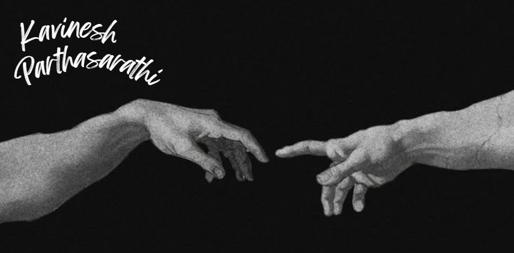
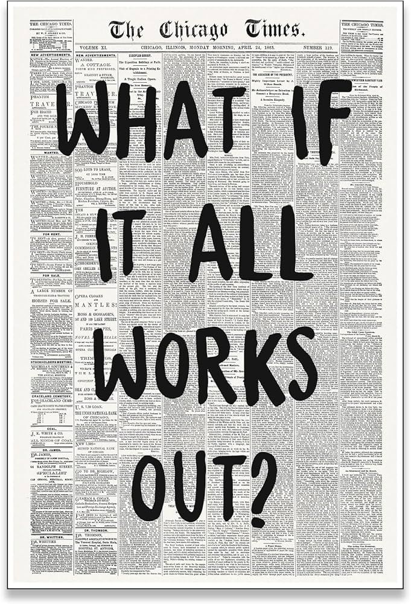
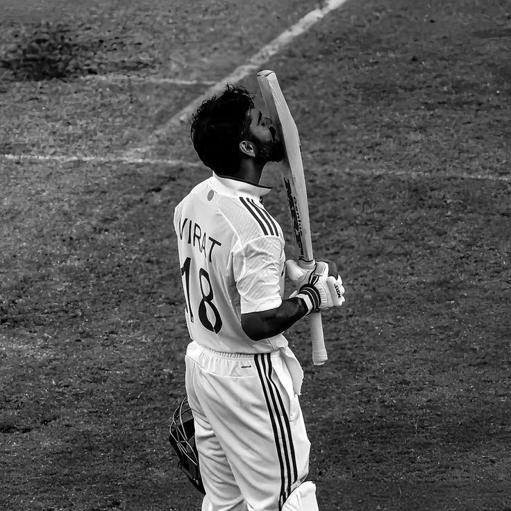

  

  <h1>ABOUT ME</h1>

  

**I'm currently a Sophomore at Amrita Vishwa Vidyapeetham,**  
**pursuing a degree in Computer Science and Engineering as well as a**  
**BS in Data Science at IIT Madras.**

`Backend Engineer` &nbsp; `AI & DL Research` &nbsp; `System Architecture` &nbsp; `UI/UX` &nbsp; `Agentic AI Dev`

  <h1>Chronicles</h1>

<table align="center" width="90%">
  <tr>
    <td valign="top" width="55%">
      <h2>Experience</h2>
      
<strong>Web Development Intern</strong> Scriptnex, India

      
<strong>AI and Backend Intern</strong> GTKonnect, Irvine, CA

      
<strong>MTS Intern</strong> Zoho, Chennai, India

      
<strong>AI and Backend Intern</strong> Iquantm Technologies, UK

      
<strong>AI Advisor</strong> Portal.so

    </td>
    <td valign="top" align="center" width="45%">
      
    </td>
  </tr>
</table>

<table align="center" width="90%">
  <tr>
    <td valign="top" align="center" width="45%">
      
    </td>
    <td valign="top" width="55%">
       
      <b> Research Experience</b>  
      <b>Sony SSUP</b> 
      <b>Volvo</b>  
      <b> Currently Cooking</b>  
      <b>AI Research</b> — Atlassian 
      <b>Undergraduate Research Assistant</b> — Stanford, United States 
      <b>Upcoming SWE Intern</b> — Amazon, Dublin, Ireland 
    </td>
  </tr>
</table>

---

### Programming Languages & Frameworks

  
  
  
  
  
  
  
  
  
  
  
  
  
  
  
  
  
  
  
  
  
  
  
  
  

---

### Development Tools & Technologies

  
  
  
  
  
  
  
  
  
  
  
  
  
  
  
  
  
  
  
  
  
  
  
  
  
  
  
  
  

---

  <h1>More of Me?</h1>

<table align="center" width="90%">
  <tr>
    <td valign="top" align="center" width="45%">
      
    </td>
    <td valign="top" width="55%">
      <h2>Love doing Hackathons and have won 8 of them</h2>
      <h2>Have been an active guy in MUNs and Quizzes</h2>
      <h2>President @iDEA Amrita</h2>
      <h2>I write poetry that bends words to my will and love watching cricket</h2>
    </td>
  </tr>
</table>

  

